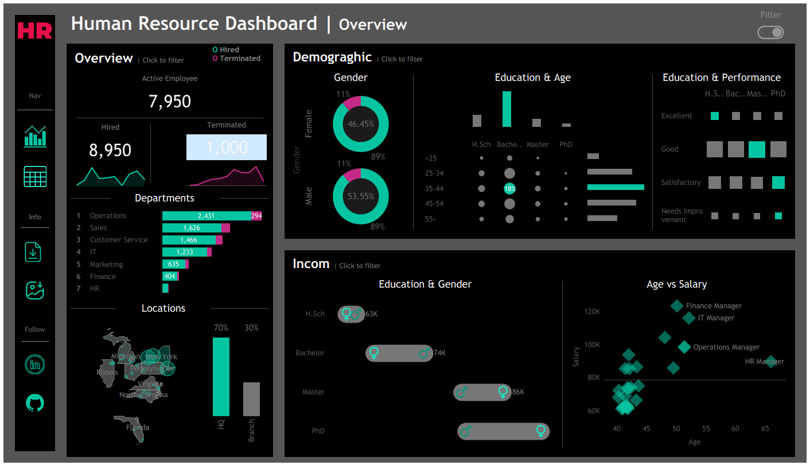
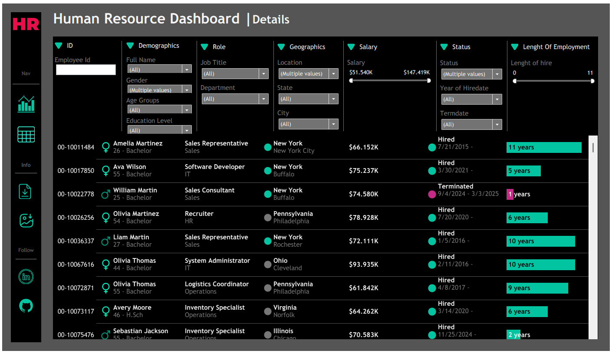

# 📊 HR Analytics Tableau Dashboard

An interactive, end-to-end Tableau dashboard designed to empower HR managers with data-driven insights. This project addresses business requirements by combining high-level summary metrics with a granular, filterable employee record directory.

---

## 📌 Project Overview & User Story

> **User Story:** As an HR manager, I want a comprehensive dashboard to analyze human resources data, providing both summary views for high-level insights and detailed employee records for in-depth analysis.

---

## 🚀 Key Features & Layout

The dashboard is structured into two main views to serve both executive-level strategy and operational detail.

### 1. Summary View
Divided into three dedicated analytical tabs/sections:

*   **📈 Overview**
    *   **KPI Cards:** Quick snapshot of Total Hires, Active Employees, and Terminations.
    *   **Hiring & Termination Trends:** Historical line chart tracking employee inflow and outflow over time.
    *   **Organizational Hierarchy:** Structural breakdown by Department and Job Title.
    *   **HQ vs. Branches:** Comparative analysis between Headquarters (New York) and regional branch locations.
    *   **Geographic Distribution:** Interactive map/chart detailing employee distribution by State and City.

*   **👥 Demographics**
    *   **Gender Balance:** Overall gender ratio across the organization.
    *   **Age & Education Breakdown:** Distribution charts for employee age brackets and highest education levels attained.
    *   **Performance vs. Education:** Correlation analysis mapping educational background against employee performance ratings.

*   **💰 Income Analysis**
    *   **Pay Equity:** Salary comparison across education levels, segmented by gender to flag potential pay gaps.
    *   **Age vs. Salary Correlation:** Scatter/trend analysis by department evaluating how age and experience impact compensation.

---

### 2. Employee Records View
*   **Detailed Directory:** A tabular record of individual employees showing key fields: *Name, Department, Position, Gender, Age, Education Level, and Salary*.
*   **Dynamic Filtering:** Global slicers/filters allowing users to drill down by any available column or attribute.

---

## 🛠️ Data Architecture & Dimensions

| Attribute Category | Fields Included |
| :--- | :--- |
| **Status & Metrics** | Employee ID, Hire Date, Termination Date, Employment Status (Active/Terminated) |
| **Location** | City, State, Location Type (HQ - New York vs. Branch) |
| **Demographics** | Gender, Age Group, Education Level |
| **Performance & Pay** | Performance Rating, Annual Salary |

---

## 📸 Dashboard Screenshots

**Overview**

  

---

**Details**

  

---

## 🔗 Live Tableau Public Link

You can view and interact with the full dashboard online here:  
👉 **[Link to Tableau Public Workbook](https://public.tableau.com/app/profile/ahmed.salah8711/viz/HRDashboard_17850729215860/HRDetails?publish=yes)"**

---

## 🧰 Tools & Technologies Used

*   **Tableau Desktop / Public:** Data visualization and interactive dashboard layout.
*   **Data Source:** Cleaned HR dataset (Excel / CSV).
*   **Calculated Fields & Parameters:** Level of Detail (LOD) expressions, KPI dynamic calculations, and custom grouping (Age Brackets).

---

## ⚙️ How to Use

1. **Clone the Repository:**
   git clone [https://github.com/your-username/hr-tableau-dashboard.git](https://github.com/your-username/hr-tableau-dashboard.git)

1. Open Workbook: Download the .twbx file from the repository and open it using Tableau Desktop or Tableau Reader.

2. Filter Data: Use the top filter panel on the Employee Records View to isolate specific departments, locations, or demographic bands.
